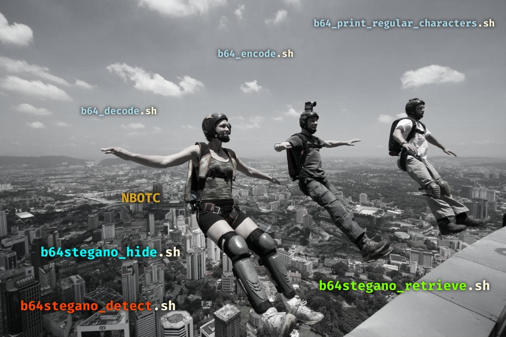

# Base64 Steganography Tools

## The principle of steganography in base64

It is based of the way that the base64 encoding principle: 

> Since the input data must consist of a whole number of bytes, only three cases are possible at the end of the sequence:
> * there are exactly 3 bytes left to encode (24 bits), then we obtain directly 4 characters without further processing ;
> * there are only 2 bytes (16 bits) left to be coded, **then we add on the right 2 bits with zeros (padding bits)** to form 3 characters of the alphabet (3×6 = 16+2 = 18 bits) followed by a fourth character "=" in complement
> * there remains only one byte (8 bits) to be coded, **then we add to the right 4 bits with zeros (padding bits)** to form 2 characters of the alphabet (2×6 = 8+4 = 12 bits) followed by two characters " = " in complement.
>
> https://fr.wikipedia.org/wiki/Base64

The principle of steganography is to use the **padding bits** to hide the bits of a message in a list of "base64 string". The decoders know that this bits are juste for padding and the values of this bits have no impact of the decoding (filling with zero is just a convention).

## The tools in Bash

At the begin, I wanted just identified the last characters of a base64 string that are not regular (right bits not padded with zero) in the `=` and `==` cases. The Bash and the [Brace Expansion](https://www.gnu.org/software/bash/manual/html_node/Brace-Expansion.html#Brace-Expansion) was a perfect candidat to build the table of the base64 characters.

And from one thing to another, I wrote all the tools in Bash using "tables" to avoid calculations.

### Steganography

* `NBOTC`: on average, just 3 bits `(0+2+4)/3` can be hide in a "base64 string", so the tools can be set (in `b64stegano_common.sh`) to use just the first 7 bits (ASCII characters) of each characters of the message instead of the all 8 bits.

Tool | Function | First parameter | Second parameter | Third parameter
---|---|---|---|---
**b64stegano_hide.sh** | hide a message to a file of "base64 string" | the message | the input filename | the output filename
**b64stegano_detect.sh** | detect non regualar "base64 string" of a file | the filename | ∅ | ∅
**b64stegano_retrieve.sh** | retrieve a message in a file of "base64 string" | the filename | ∅ | ∅

### Base64

Tool | Function | First parameter | Second parameter | Third parameter
---|---|---|---|---
**b64_print_regular_characters.sh** | print "base64 characters" | ∅ | ∅| ∅
**b64_encode.sh** | encode each line of a file to a file | the input filename | the output filename | ∅
**b64_decode.sh** | decode each line of a file to a file | the input filename | the output filename | ∅

## Credits

* [BASE jumping photography `Kl 3 way`](http://www.basejumper.com/photos/Building/Kl_3_way_796.html)
* [DELIMITRY > Olympic CTF 2014 - Find da key writeup](https://delimitry.blogspot.com/2014/02/olympic-ctf-2014-find-da-key-writeup.html) to build cross tests with:
    * the example of [file with steganography in base64](http://shell-storm.org/repo/CTF/Olympic-2014/Find_da_Key/stego.txt)
    * the script (Python version 2) to retrieve my hidden messages